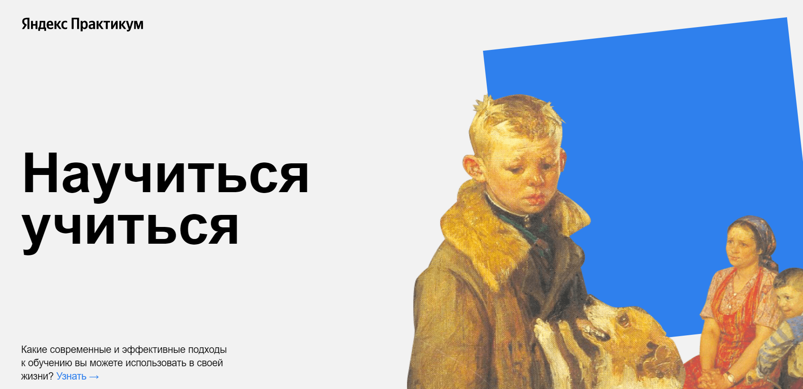

# **HOW TO LEARN**

### This is my first project created at Ya.Practicum course "WEB developer"
***
#### On this site you will find some useful links, videos and resources that will help you choose the learning method that is right for you.
***
#### Technological stack
- HTML5
- CSS3
***
##### [Here](https://polinalashchanka.github.io/how-to-learn/) you will find a link to deployed project

